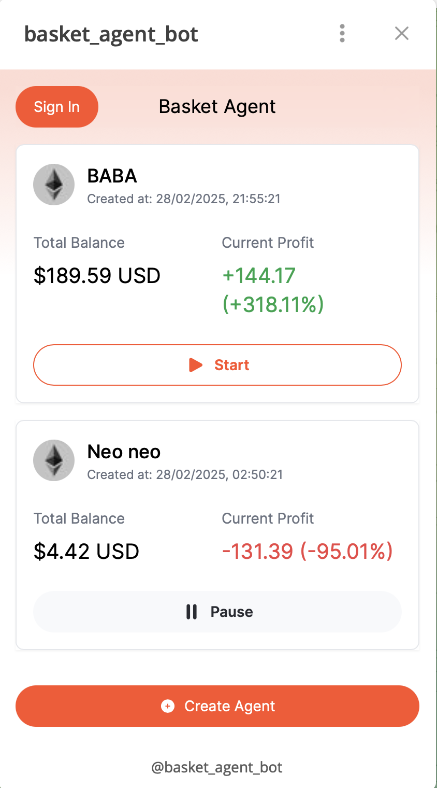
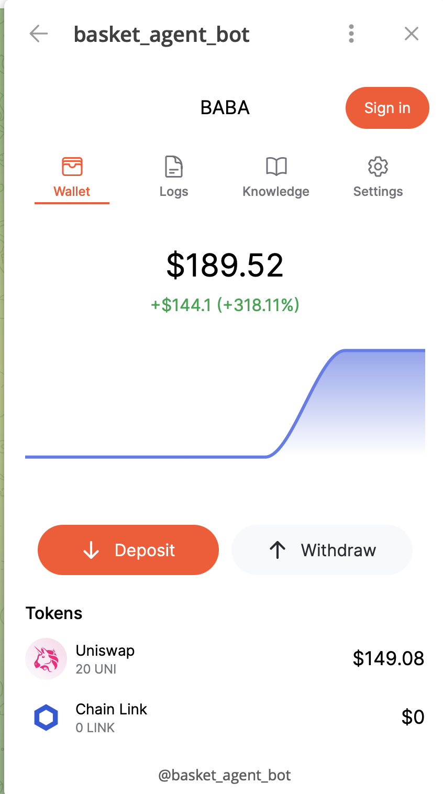
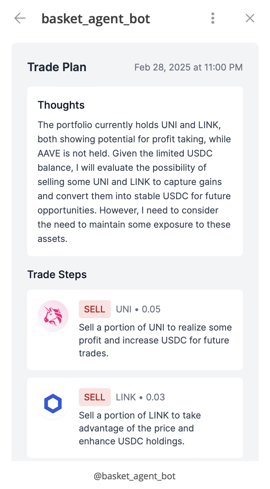

# Basket Agent Telegram Mini App

Basket Agent is a Telegram MiniApp that allows users to buy and sell tokens using an agent-based trading strategy. The application is designed to optimize trades for better efficiency and performance, leveraging automated strategies to maximize profitability while minimizing risks.

Join us and start discovering new approaches to trading with Basket Agent on Telegram!: [@basket_agent_bot](https://t.me/basket_agent_bot)

## Features

- Agent-Based Trading: The app uses AI-driven agents to analyze market trends and execute trades based on predefined strategies.
- Stablecoin as Base Token: Users can trade various tokens using a stablecoin as the base currency, ensuring lower volatility and higher liquidity.
- Optimized Trade Execution: The agent evaluates market conditions, liquidity pools, and trading fees to execute the best possible trades.
- User-Friendly Interface: Accessible directly via Telegram, providing a seamless trading experience.
- Security and Transparency: All transactions are executed securely with verifiable trade logs.
- Integration with Para: Basket Agent now integrates with Para, allowing users to onboard securely with cross-app embedded wallets that work across apps, chains, and ecosystems.
- Wallet Pregeneration with Para: Users can have wallets created before setup, enabling seamless onboarding and giving control over when they claim ownership.

## Get Started
1. Get Para API Key: [Para API](https://developer.getpara.com/)
2. Get Reown API Key: [Reown API](https://reown.com/)
3. Prepare Backend Server: [Basket Agent API](https://github.com/EmbraceXTech/basket-agent-backend)
4. Setup environment variables: `cp .env.example .env`

## Running the development server
1. Install dependencies: `npm install`
2. Run the development server: `npm run dev`
3. Access the application at `http://localhost:5173`

## Screenshots

## Relevant Repositories
- [Basket Agent API](https://github.com/EmbraceXTech/basket-agent-backend)
- [Basket Agent Frontend](https://github.com/EmbraceXTech/basket-agent-mini-app)